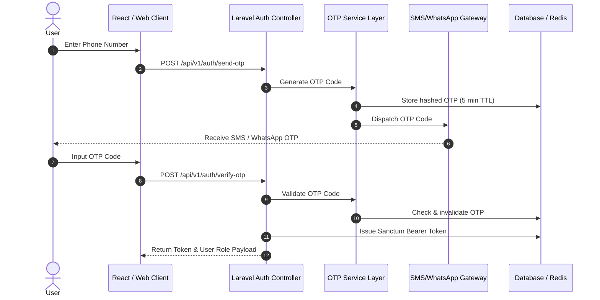

# 🔐 Authentication Flow Specification

## OTP & Sanctum Authentication Sequence

## Security & Policies
- **Token Expiry:** Configurable Sanctum expiration.
- **Rate Limiting:** Maximum 3 OTP requests per phone number per 15 minutes.
- **Role Control:** Middleware check (`role:admin`, `role:practitioner`, `role:user`).
