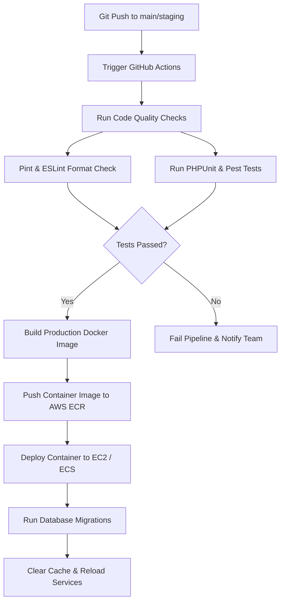

# 🔄 CI/CD Pipeline Specification

## GitHub Actions Workflow

```mermaid
graph TD
    A[Git Push to main/staging] --> B[Trigger GitHub Actions]
    B --> C[Run Code Quality Checks]
    C --> D[Pint & ESLint Format Check]
    C --> E[Run PHPUnit & Pest Tests]
    D --> F{Tests Passed?}
    E --> F
    F -- Yes --> G[Build Production Docker Image]
    F -- No --> H[Fail Pipeline & Notify Team]
    G --> I[Push Container Image to AWS ECR]
    I --> J[Deploy Container to EC2 / ECS]
    J --> K[Run Database Migrations]
    K --> L[Clear Cache & Reload Services]
```
