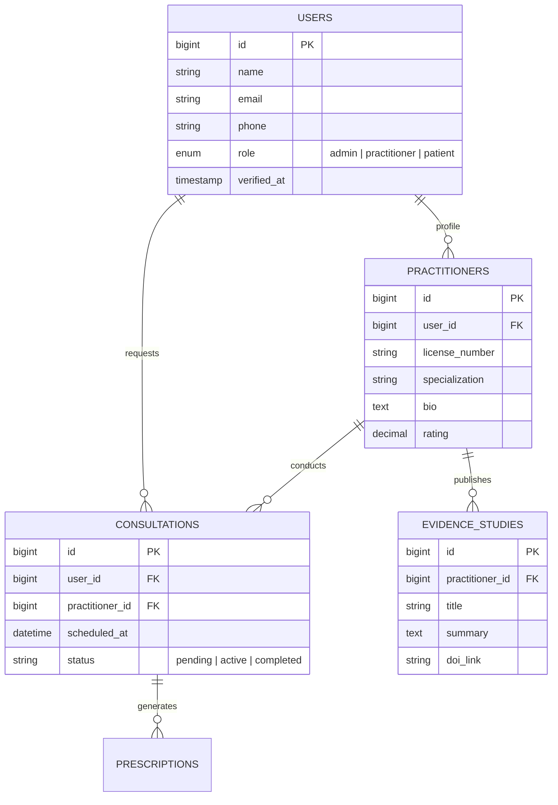

# 🗄️ Database Entity Relationship Diagram (ERD)

## Core Schema Entities

```mermaid
erDiagram
    USERS ||--o{ PRACTITIONERS : profile
    USERS ||--o{ CONSULTATIONS : requests
    PRACTITIONERS ||--o{ CONSULTATIONS : conducts
    PRACTITIONERS ||--o{ EVIDENCE_STUDIES : publishes
    CONSULTATIONS ||--o{ PRESCRIPTIONS : generates

    USERS {
        bigint id PK
        string name
        string email
        string phone
        enum role "admin | practitioner | patient"
        timestamp verified_at
    }

    PRACTITIONERS {
        bigint id PK
        bigint user_id FK
        string license_number
        string specialization
        text bio
        decimal rating
    }

    CONSULTATIONS {
        bigint id PK
        bigint user_id FK
        bigint practitioner_id FK
        datetime scheduled_at
        string status "pending | active | completed"
    }

    EVIDENCE_STUDIES {
        bigint id PK
        bigint practitioner_id FK
        string title
        text summary
        string doi_link
    }
```
